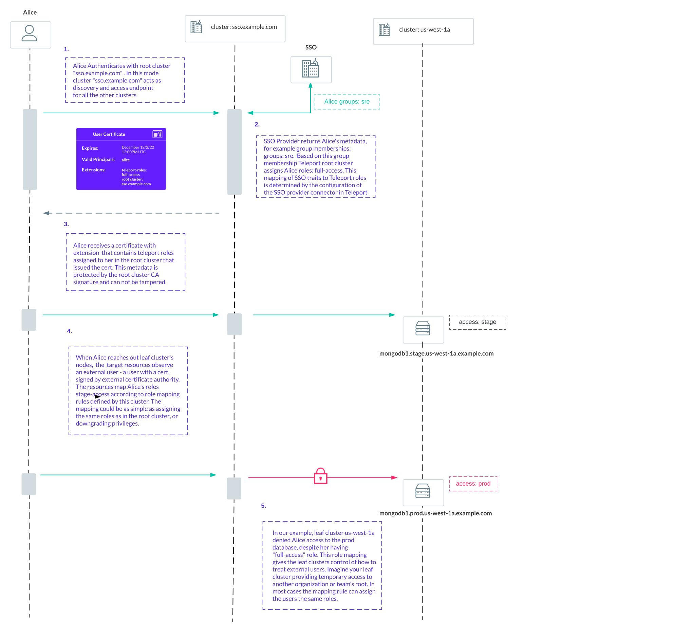

## Overview

Teleport can partition compute infrastructure into multiple clusters. A cluster
is a group of Teleport resources connected. Each clustes
manages a separate certificate authority (CA) for all users and resources.

Trusted Clusters allow the users of one cluster, the **root cluster**, to
seamlessly SSH into the Nodes of another cluster, the **leaf cluster**, while
remaining authenticated with only a single Auth Service. The leaf cluster can
be running behind a firewall without any ingress ports open.

Uses for Trusted Clusters include:

- Managed service providers (MSP) remotely managing the infrastructure of their clients.
- Device manufacturers remotely maintaining computing appliances deployed on premises.
- Large cloud software vendors managing multiple data centers.

<Notice type="tip">
Individual nodes and proxies can create reverse tunnels to proxy serivices without creating a new cluster.
You don't need to set up a trusted cluster just to connect a couple of servers, kubernetes clusters or
databases behind a firewall.
</Notice>

## Case-study: Multi-Datacenter Clusters

In the example below, there are three independent clusters:

- Cluster `sso.example.com` is a root cluster. This cluster can be used as a single-sign-on entrypoint
for your organization. It can have it's own independent resources connected to it, or be used just for audit
logs collection and single-sign-on.
- Clusters `us-east-1a` and `us-east-1b` are two independent clusters in different availability zones.

## Role Mapping

## Next steps

Read the rest of the Architecture Guides:

- See how Teleport uses [Certificates](authentication.mdx) for authentication.
- Reduce your surface of attack using [TLS routing](./tls-routing.mdx).
- Follow our [guide](../setup/admin/trustedclusters.mdx) to set up trusted clusters.

